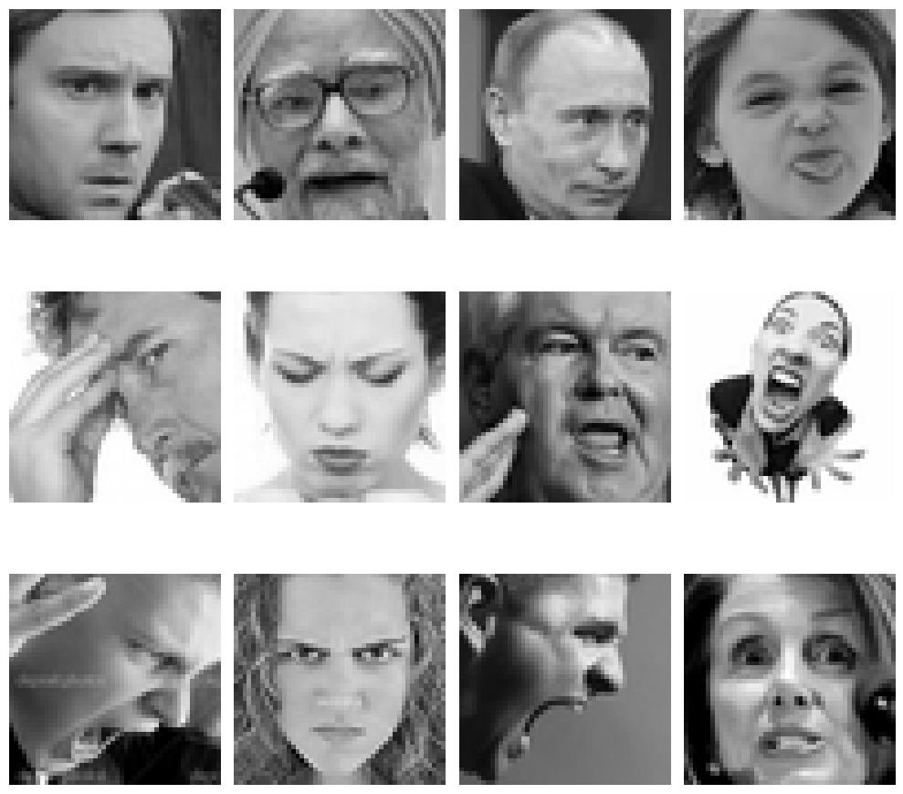
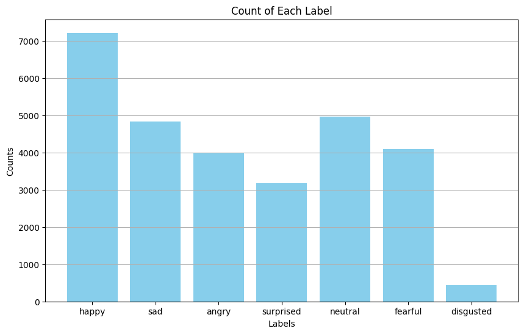
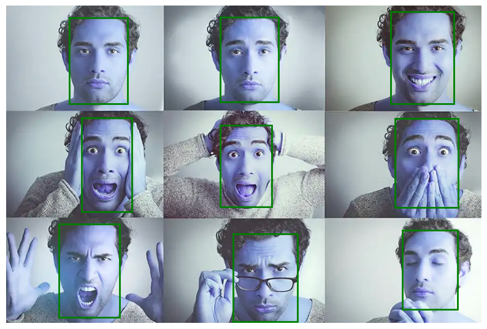
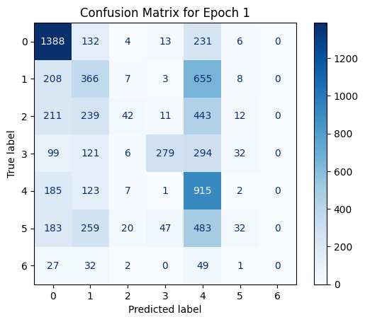
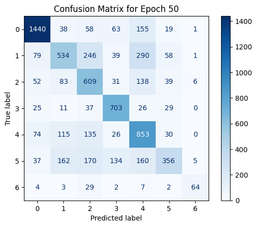
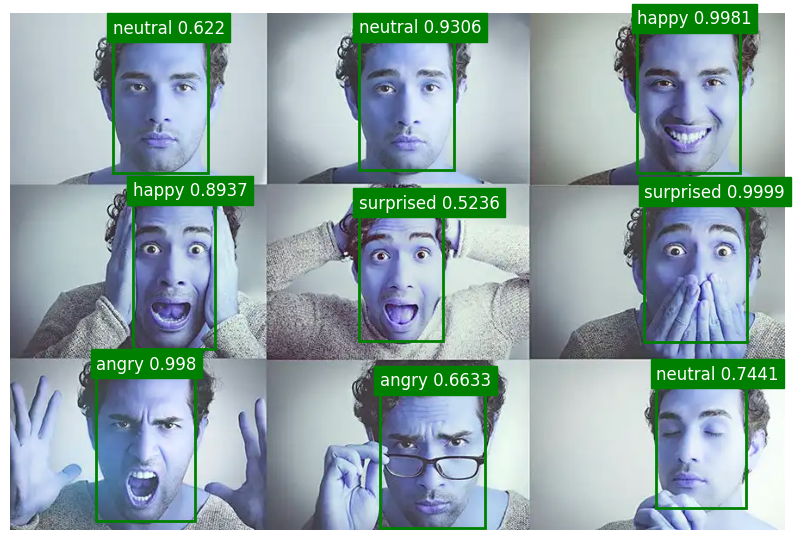

# Context
This is I think my third project(?) that I will be uploading to GitHub. The project was completed over around 4 days with the intention of building familiarity with image processing methods, as well as the PyTorch library. Personally I am more used to using the tensorflow/keras library as it's what I used starting out. However, after slowly realising that many projets/research are shifting towards using mainly PyTorch, I decided to just bite the bullet and try to learn to use the library, and although there was some confusion at the start, I'm also slowly warming up to this library. 

This project is completely self directed, so the documentation will be somewhat informal, as it serves more as a reference for my future self. To keep things simple I will be partly utilising an imported model. For the remaining part I would be lifting a pre-made dataset from [kaggle.com](https://www.kaggle.com/datasets/jonathanoheix/face-expression-recognition-dataset/data)

The coding can all be found in [this jupyter notebook](insert_notebook_link), with details of the environment [here](insert_requirements.txt_link)

# Table of Contents

- [Objectives](#objectives)
- [Imported Model](#imported-model)
- [Dataset](#dataset)
- [Model Description](#model-description)
- [Results](#results)
- [Closing Thoughts]

# Objectives
The primary objective of this project is to build a deep learning model that can:
1. Correctly identify peoples faces given an image
2. For each face it identifies, be able to classify the emotion being displayed, out of 7 possible categories
We will go into more details of the evaluation metrics and categories in the Dataset and Model Description section. As there is not underlying business requirement for this project (eg. maximise recall on emotion detection), we will be using accuracy as our main evaluation metric. 

A second objective is simply to learn more about image processing, and get myself more accustomed to the PyTorch library.

# Imported Model
For the face detection part of the project, I will be utilising a fine tuned version of the [YOLO v8 model](https://docs.ultralytics.com/models/yolov8/) by Ultralytics. The YOLOv8 model is one of the newer version in the YOLO series of object detectors, with improved accuracy, speed, and efficiency compared to its predecessors. Although it is capable of achieving various functions, I will mainly be using it for the face detection part of my model. The model can be easily imported simply by first running the `pip install ultralytics` command, then executing the following:

```Python
from ultralytics import YOLO

model = YOLO('yolov8n.pt')
```

For the purpose of this project, I used a version of the model fine-tuned for face detection by user [arnabdhar](https://huggingface.co/arnabdhar). This model was fine tuned on a dataset of over 10k images containing human faces for 100 epochs, and is capable to downstream tasks such as face detection/recognition. The model can be easily imported through the huggingface library as follows:

```Python
model_path = hf_hub_download(repo_id="arnabdhar/YOLOv8-Face-Detection", filename="model.pt")

model = YOLO(model_path)
```

# Dataset
For the second part of my model I would be training my own CNN (convolutional neural network) for the purpose of emotion classification, where given an image of a person's face, returns a classification out of 7 possible emotions. The dataset I would be using to train the model is lifted directly from [kaggle.com](https://www.kaggle.com/datasets/jonathanoheix/face-expression-recognition-dataset/data). The dataset contains a total of 35887 images, split into two directories (train: 28821, test: 7066), each containing another 7 sub-directories, one for each emotion, being: angry, disgust, fear, happy, neutral, sad, surprise. As an extra note, I would be using validation and test set interchangeably throughout this project. 

After downloading the dataset, I explored the data a little to get a feel of what it looked like, and grouped them into one large dataframe containing the images and their corresponding labels, split into the training and validation set. Something I've discovered during the project was that I can simply set the parameter `shuffle = True` when setting the DataLoader. Hence although I did keep the block that shuffles the dataset around for training, that part is not needed to train the model properly.

We start by taking a look at the types of images we are working with, as well as the distribution of the dataset





Immediately we spot two main problems. First of all, the images are generally pretty blurry and low resolution, this might make it difficult for the model to learn detailed features about the dataset. Another problem is that there are significantly more images of happy faces compared to disugusted ones. Which to some extent we do expect as data for diusgusted faces are harder to obtain. Now that we have a slightly better idea of the what our data looks like and its distribution, we can move on to building the model.

# Model Description
The face-detection part of the model is done as I have explained in a previous section. We simply import the fine-tuned YOLOv8 model from the huggingface library. A quick test allows us to see that the model is mostly working as intended.



Now that we can correctly identify the faces, what's left is to determine the emotion being displayed. We will create a pipeline where after detecting the faces in an image, the images are cropped out, and returned as individual images. These images of cropped out faces are then fed into an emotion classification model, and the prediction is returned. Finally, we combine the labels and the boxes to complete our objective. Before I go into more details about the model, I would like to talk a bit more about the libraries/functions/methods I've used. 

## cv2
cv2 is an open source computer vision library that is commonly used for image analysis. I believe I have used this library before in my [mug training]() project, but have never gone too deep into exploring its uses. Some of the functions I've used the most are:

1. `cv2.imread` 
Given the path to an image, returns an array that can be read by the machine
2. `cv2.resize`
Given an image (array) and the desired size, returns the resized image
3. `cv2.imshow`
Given an image array, prints out an image that can be viewed
4. `cv2.rectangle`
Given an input image and coordinates of the rectangle, draws a rectangle on an image

While there are many other useful functions, I havn't really been able to use any of them throughout this project. I do believe `cv2.findContours` would be useful to me in the future if I were to start a project on image segmentation.

## torch
PyTorch is in a way a tensorflow keras equivalent. While it is slighttly less straight forward, it allows more flexibility and is used more often in research. This leads a lot more models and techniques that are available. Another import feature is PyTorch provides APIs for GPU operations. This makes training complex models much faster, despite the slight drawback of having to keep both the model and inputs in the GPU. Even though I can to some extent use it to build models, there are still many things that I haven't explored about this library. 

## Confusion Matrix
The only other time I've used confusion matrix is for my spam classification model. However, as it only had two classes (spam and ham) there wasn't too much I can show. In this project, as there are 7 different classes, we can see much better how the model learns over each epoch, and which classes are regularly being confused with other classes. While it feels a bit more difficult to implement in PyTorch, as a visualisation tool it provides a lot of information on the performance of the model

## adam optimizer
The adam optimizer is something I've worked with when taking the Machine/Deep learning specialization course by Andrew Ng. I would also encourage my future self to try out different other optimizers instead of defaulting to adam. As a brief introduction Adam stands for Adaptive Momentum Estimation. By adjusting the learning rates for each parameter individually, Adam helps the optimizer converge faster and more reliably. 

## Batch Normalization
Batch Normalization is a common technique in deep learning that helps stabilize and accelerate the training of neural networks. In each layer, the input batches are first normalized, and then sacled and shifted as needed. This often results in faster training as it prevents the changes in distributions of the network activations over updating parameters. It also makes the training process less sentsitive to initialization and hyperparameters, preventing the model from overfitting to the training set to some extent. 

## Dropout
Dropout is another regularization technique commonly used in deep learning to prevent overfitting. By randomly setting a fraction of the input units (neuron) to zero, you prevent the network from becoming overly reliant on any particular neuron, thus improving its ability to actually learn about the data rather than memorizing specific details. 

---

For emotion classification, I will be building and training a convolutional neural network using PyTorch. For the model, I included 4 convolutional layers, each with a ReLU activation, as well as batch-normalisation and dropout layers in between. Then followed by a flatten layer, and two fully connected layers, with a softmax output to determine the class. The specific code with annotations is as follows.

```Python
# Import libraries
import torch
import torch.nn as nn

# Define model class
class SimpleCNN(nn.Module):

    # Initiate class
    def __init__(self):
        super(SimpleCNN, self).__init__()
        
        # Define layers
        self.conv1 = nn.Conv2d(in_channels=3, out_channels=64, kernel_size=3, stride=1, padding = 1)
        self.bn1 = nn.BatchNorm2d(64)
        self.conv2 = nn.Conv2d(in_channels=64, out_channels=128, kernel_size=5, stride=1, padding = 2)
        self.bn2 = nn.BatchNorm2d(128)
        self.conv3 = nn.Conv2d(in_channels = 128, out_channels = 512, kernel_size = 3, stride = 1, padding = 1)
        self.bn3 = nn.BatchNorm2d(512)
        self.conv4 = nn.Conv2d(in_channels = 512, out_channels = 512, kernel_size = 3, stride = 1, padding = 1)
        self.bn4 = nn.BatchNorm2d(512)
        self.pool = nn.MaxPool2d(kernel_size=2, stride=2, padding=0)
        self.dropout = nn.Dropout(0.25) # Dropout layer with 25% probability of ignore inputs
        self.fc1 = nn.Linear(4608, 256)  
        self.fc2 = nn.Linear(256, 512)
        self.fc3 = nn.Linear(512, 7)
        
    # Define feed-forward network
    def forward(self, x):
        # Four consecutive convolutional layers using ReLU activation with batch-normalization and dropout layers in between. 
        x = self.pool(nn.ReLU()(self.bn1(self.conv1(x)))) # Output shape of (64, 24, 24)
        x = self.dropout(x)
        x = self.pool(nn.ReLU()(self.bn2(self.conv2(x)))) # Output shape of (128, 12, 12)
        x = self.dropout(x)
        x = self.pool(nn.ReLU()(self.bn3(self.conv3(x)))) # Output shape of (512, 6, 6)
        x = self.dropout(x)
        x = self.pool(nn.ReLU()(self.bn4(self.conv4(x)))) # Output shape of (512, 3, 3)
        x = self.dropout(x)

        # Flatten layer
        x = x.view(x.size(0), -1)  # Flatten to (512 x 3 x 3, -1)

        # Two fully connected layers
        x = nn.ReLU()(self.fc1(x)) # Output Shape of 256
        x = nn.ReLU()(self.fc2(x)) # output shape of 512

        # Softmax Output layer
        x = self.fc3(x) # Output Shape of 7
        return x
```

This Model is trained using Cross Entropy Loss as the criterion, and uses the adam optimizer with a learning rate of 0.0001 for a total of 50 epochs. We will now discuss the results after training. 

# Results
I will be splitting this results section into two different parts. One on the results of the emotion classification model, and the other on the entire combined model as a whole.

## Results (Classification Task)
Looking strictly at the classification task, after 50 epochs, we were able to achieve an accuracy of around 65%, with slight fluctuations between epochs. 

- Epoch [46/50], Loss: 0.3173
Validation Loss: 1.2893, Accuracy: 64.29%
- Epoch [47/50], Loss: 0.3110
Validation Loss: 1.2738, Accuracy: 64.80%
- Epoch [48/50], Loss: 0.2978
Validation Loss: 1.3349, Accuracy: 65.07%
- Epoch [49/50], Loss: 0.2886
Validation Loss: 1.3060, Accuracy: 65.42%
- Epoch [50/50], Loss: 0.2872
Validation Loss: 1.4160, Accuracy: 63.51%

This is rather impressive as unlike a binary classification task, there are 7 different possible classes. For a simple CNN model this accuracy is better than I expected, and with some help it may be able to reach above 70%. We do see that there are signs of overfitting to the training data, but it's to a degree within control. Let's then take a look at what our model is getting wrong both before and after training using a confusion matrix.



During the first epoch, the model's predictions are generally pretty off. It also seems to be predicting either class 0 (happy) or class 4 (neutral) most of the time, which is a reasonable decision since they make up a large portion of the data. Let's now take a took at the model's predictions after training.



After training, the model's predictions are definitely getting a lot more accurate, with a majority of the predictions being accurate. Notably, the model does not seem to be able classify sadness very well, often confusing sadness with either anger and neutral. 

## Results (Full-Model )
Overall the model's performance really depends on the performance of the classification model, as we are simply feeding the cropped faces extracted from the detection model into the classification model. A quick test allows us to see that the model is working as intended, although not being perfect in classifying emotions. 



## Closing Thoughts
Besides directly importing and using huggingface models, this is the first actual project where I have used PyTorch to build and train my models. There are definitely parts that I can get more used to, but I am also slowly warming up to using PyTorch over Keras. It also helps in general as many recent research papers and libraries that are written in or based on PyTorch. I have also gotten more used to using graphs and plots to visualize my dataset and results. This helps me make more informed decisions about the model I use, the hyperparameters I choose, as well as rooms for improvement after training. This is also the first time I'm chaining multiple models toegther to complete a more complex task. (eg. face detection and emotion classification being two separate tasks for one model). Overall I was able to gain a much better understanding of how to build models to solve complex tasks, as well as improving among said models. 

(As an afterthought, although the imported model is based on YOLOv8, the newest version of YOLO is currently v11, perhaps fine-tuning the newer model for face-detection would lead to better results)